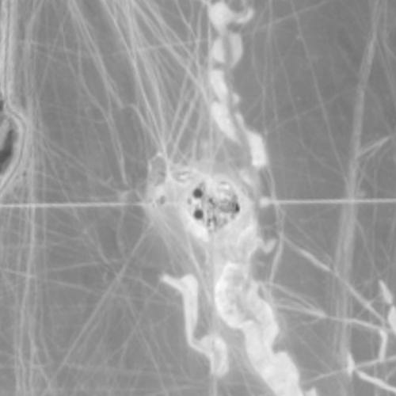
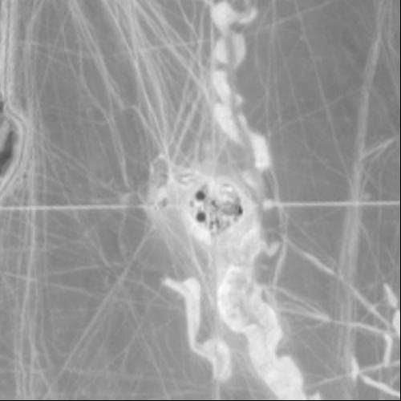

# Pandora2D

<h1 align="center">

</h1>

<h4 align="center">Pandora2d  is a tool based on [Pandora](https://github.com/CNES/Pandora) to provide disparity maps
for images pairs with a combination of vertical and horizontal stereo.</h4>

<p align="center">
  <a></a>
  <a href='https://pandora2d.readthedocs.io/?badge=latest'></a>
  <a href="https://opensource.org/licenses/Apache-2.0/"></a>
</p>

<p align="center">
  <a href="#example-of-use">Example of use</a> •
  <a href="#install">Install</a> •
  <a href="#first-step">First Step</a> •
  <a href="#to-go-further">To go further</a> •
  <a href="#credits">Credits</a> •
  <a href="#related">Related</a> 
</p>

## Example of use

* Not-aligned Sentinel2 images from Ouarzazate's Solar Central.

Before Pandora2D   |  After Pandora2D
:-----------------:|:----------------:
  |  


## Install

Pandora2D is available on Pypi and can be installed by:

```bash
    #install pandora2d latest release
    pip install pandora2d
````

## First step

Pandora2d requires a `config.json` to declare the pipeline and the pair of images to process.
Download our data sample to start right away !

- [maricopa's pair with combination of vertical and horizontal stereo](https://raw.githubusercontent.com/CNES/Pandora2D/master/data_samples/images/maricopa.zip)
- [a configuration file](https://raw.githubusercontent.com/CNES/Pandora2D/master/data_samples/json_conf_files/a_basic_pipeline.json)

```bash
    # Images pairs with a combination of vertical and horizontal stereo
    wget https://raw.githubusercontent.com/CNES/Pandora2D/master/data_samples/images/maricopa.zip
    # Config file
    wget https://raw.githubusercontent.com/CNES/Pandora2D/master/data_samples/json_conf_files/a_basic_pipeline.json
    #uncompress data
    unzip maricopa.zip
    # run Pandora2d
    pandora2d a_basic_pipeline.json output_dir

    # The columns disparity map is saved in  "./res/columns_disparity.tif"
    # The row disparity map is saved in  "./res/row_disparity.tif"
```

## To go further

To create your own coregistration pipeline and choose among the variety of
algorithms we provide, please consult [our online documentation](https://pandora2d.readthedocs.io/en/latest/).

You will learn:

* which steps you can use and combine
* how to quickly set up a Pandora2D pipeline

## Credits

Our data test sample contains  modified  'Copernicus  Sentinel  data  [2021]'  for  Sentinel  data, provided by the Peps Sentinel2 website (CNES). 


## Related

* [Pandora](<https://github.com/cnes/pandora>) - stereo matching framework
