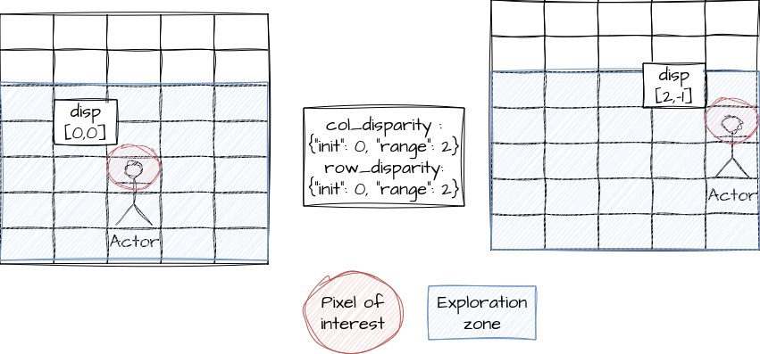

.. _initial_disparity:

Disparity range exploration
===========================

The user is required to set up pandora2d by specifying a range of disparity to be explored.
There are two available methods to do this.

Setting an interval
-------------------

In the configuration file, the user is required to enter disparity range for rows and columns, as a dictionary with 2 keys "init" and "range".

.. code:: json
    :name: Setting disparity ranges example

    {
        "input":
            {
                "col_disparity": {"init": 0, "range": 2},
                "row_disparity": {"init": 0, "range": 2}
        }
    }

.. note::
    The "init" key can be either: 
        - an integer if the initial disparity is common to every point in the image.
        - a path to a disparity grid if each point has its own initial disparity value.
        
    (see :ref:`inputs`)

The min and max disparity would then be equal to (example for columns): 

.. code:: python
    :name: Calculating the min and the max of the disparity
	
    min_col_disparity = col_disparity["init"] - col_disparity["range"]
    max_col_disparity = col_disparity["init"] + col_disparity["range"]
    
    

Setting a range
---------------

In situations where the user does not know the required interval range, an alternative method is provided.
The user must leave the 'col_disparity' and 'row_disparity' parameters empty. Instead, they need to enable an estimation stage in the pipeline. This stage calculates a global shift throughout the image. By using 'range_col' and 'range_row' parameters, the user can then approximate an interval around this determined shift.

The following diagram illustrates how the disparity intervals are initialized using the estimation step:

.. figure:: ../Images/estimation_schema.png
    :align: center
