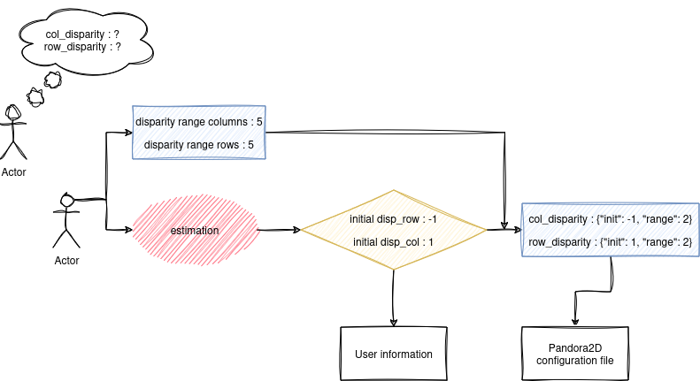

.. _initial_disparity:

Disparity range exploration
===========================

The user is required to set up pandora2d by specifying a range of disparity to be explored.
There are two available methods to do this.

Setting an interval
-------------------

In the configuration file, the user is required to enter disparity range, as a list with two elements each, indicating
the minimum and maximum values for both row and columns disparity.

.. code:: json
    :name: Setting disparity ranges example

    {
        "input":
            {
                "col_disparity": [-2, 2],
                "row_disparity": [-2, 2]
        }
    }

.. figure:: ../Images/range_schema.png

Setting a range
---------------

In situations where the user does not know the required interval range, an alternative method is provided.
The user should leave the 'disparity_col' and 'disparity_row' parameters empty. Instead, they need to enable an estimation stage in the pipeline. This stage calculates a global shift throughout the image. By using 'range_col' and 'range_row' parameters, the user can then approximate an interval around this determined shift.

The following diagram illustrates how the disparity intervals are initialized using the estimation step:

