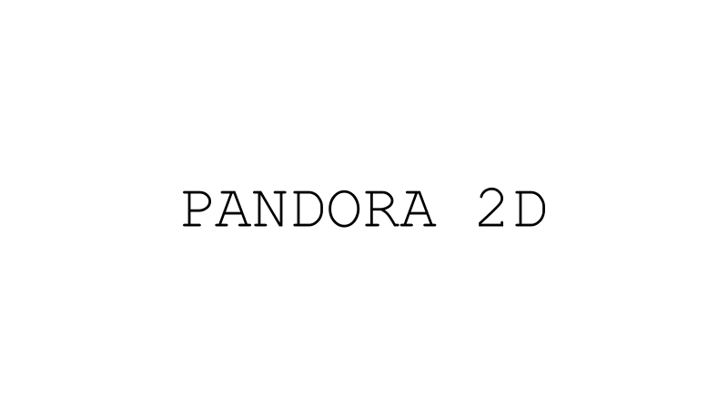

.. _exploring_the_field_matching_cost:

Matching cost computation
=========================

The cost volume holds the similarity coefficients between the image pair. It's a 4D matrix with these dimensions:

- `row`: rows in the images
- `col`: columns in the images
- `disp_row`: row's disparities
- `disp_col`: column's disparities

For each disparity in the input vertical disparity range (disp_min_row, disp_max_row),
Pandora2D will shift the right image by the corresponding vertical disparity
and call Pandora to compute a cost volume with the input horizontal disparity range (disp_min_col, disp_max_col).

Different measures of similarity are available in Pandora2D to compute these coefficients (see :ref:`matching_cost` for more information on their usage):

- SAD (Sum of Absolute Differences)
- SSD (Sum of Squared Differences)
- ZNCC (Zero mean Normalized Cross Correlation)
- MI (Mutual Information)
- MCCNN (Neural network which computes a similarity measure) (MANDATORY: pandora_plugin_mccnn) (please see: `pandora documentation <https://pandora.readthedocs.io/en/stable/userguide/plugins/plugin_mccnn.html>`_)

Let's see in following sections how they work.

Mutual Information
------------------

.. tip::
    Mutual Information is best used to measure similarities of images obtained from different spectral bands.
    Because it takes longer to calculate than other methods, it might not add any value in other cases.

The concept is to compute the amount of information contained in the images and maximize the shared information.
This is achieved by computing the entropy of the images.

Due to its statistical nature, this method does not make any assumptions about the source of the images.
This explains why it is a method of choice for comparing images from different spectral bands.
This also implies to have enough data *i.e* large enough images.

Mutual Information's computation
^^^^^^^^^^^^^^^^^^^^^^^^^^^^^^^^

Mutual Information :math:`MI(I, J)` is the sum of the entropy of each image minus the joint entropy:

.. math::
    MI(I, J) = H(I) + H(J) - H(I, J)

In our case, the computation is not done on the whole image but on the matching windows centered around each disparities
in the disparity range.

Entropy's computation
^^^^^^^^^^^^^^^^^^^^^

The entropy :math:`H(I)` of image :math:`I` used in Pandora2D is a direct application of the Shannon's formula:

.. math::
    H(I) = - \sum_{i} P_i \log_{2} (P_i)

Where :math:`P_i` is the density of probability of pixel :math:`i` that is computed by means of bins' count values in the histograms as this:

.. math::
    P_i = \frac{\text{number of pixels in bin i}}{\text{number of pixels in the image}}

The entropy :math:`H(J)` of image :math:`J` can be computed the same way and the joint entropy :math:`H(I, J)` of the images is:

.. math::
    H(I,J) = - \sum_{i} \sum_{j} P_{ij} \log_{2} (P_{ij})

Histogram determination is therefore a key point of the process.

Histograms' computation
^^^^^^^^^^^^^^^^^^^^^^^^

Pandora2D does not use a predetermined number of bins for the histograms, instead it first derives a Bin's width from the Scott formula:

.. math::

    width = SCOTT\_FACTOR \times \sigma \times image\_size^{-1/3}

| Where `SCOTT_FACTOR` is `3.491` and :math:`\sigma` is the standard deviation of pixel values of the image.
| *In case the standard deviation is null, the width is set to* :math:`1`.

The dynamic range of the histogram is the difference between the maximum pixel value and the minimum pixel value:

.. math::
    dynamic\_range = max - min

Then, the number of bins is computed as:

.. math::
    N_{bins} = \frac{\text{dynamic\_range}}{width} + 1 = \frac{max - min}{width} + 1

An additional bin is added to take into account boundaries.

In order to equilibrate the histogram, all bins are shifted:

.. image:: /Images/histogram.drawio.svg
    :align: center

The dynamic range is then :math:`[lower\_bound ; upper\_bound]`.

.. note::
    The number of bins is limited to 100. In the case the number exceed this limit, the dynamic's bounds are changed to be at most :math:`[-4 \times variance ; 4 \times variance]`.

To determine which bin a pixel falls into, we use:

.. math::
    i = max \left(0,\ min \left( \left\lfloor \frac{ \text{pixel\_value} - \text{lower\_bound} }{ \text{bin\_width} } \right\rfloor , N_{bins} \right) \right)

Below, a schema explains how to create the joint histogram (histogram 2D) in a very simple case where bins are only a
cout of pixel values and where windows have the same dynamic range:

.. image:: /Images/simple_histogram2D_how_to.drawio.svg
    :align: center

Now that the simple case has been explained, here's a more complete example where:

- pixel values are floats.
- dynamic range of the windows are different which result in a different number of bins.
- histogram is centered.
- we do not use the Scott formula to determine bins' width but we assume a width of 1 for demonstration purpose.

.. image:: /Images/complete_histogram2D_how_to.drawio.svg
    :align: center
