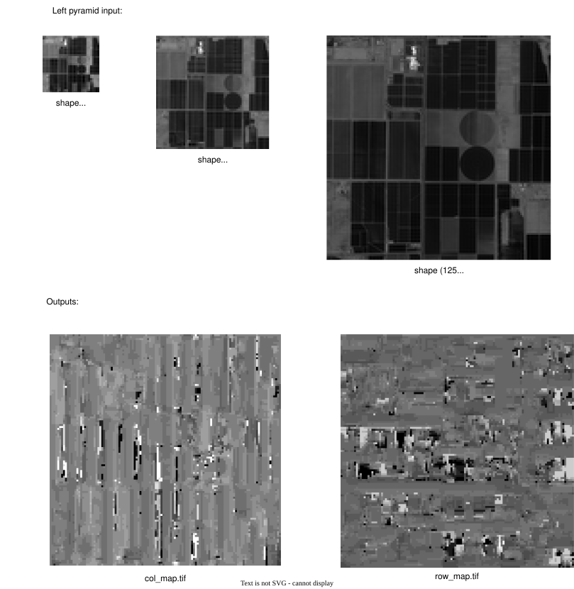

.. _multiscale_mode:

Multiscale mode
===============

In order to process an image more quickly and robustly with pandora2d, it is possible to use multiscale mode. 
This mode launches pandora2d pipelines on a given image in different resolutions. 

To use multiscale mode, you must be on the gitlab pandora2d **mvp-pandora2d-multiscale** branch.

Multiscale mode can be launched with the following command: 

.. code-block:: console

    python -m src.pandora2d.multiscale.multiscale data_samples/json_conf_files/a_multiscale_pipeline.json

We can use a verbose mode: 

    - -v option prints informations about multiscale pipeline
    - -vv option prints informations about multiscale and pandora2d pipelines

.. hint:: 
    It is possible to run a_multiscale_pipeline.json `a_multiscale_pipeline.json <https://gitlab.cnes.fr/dali/PandoraBox/pandora2d/-/blob/mvp-pandora2d-multiscale/data_samples/json_conf_files/a_multiscale_pipeline.json>`_ located in the pandora2d gitlab repository on the mvp-pandora2d-multiscale branch. 
    
    The image pyramids used are derived from the left.tif and right.tif images in the maricopa folder that were first downsampled by a factor 4.
    Then these images were downsampled again by factors 4 and 2 to create pyramids of 3 images with subsampling factors of 1, 2, and 4.

To learn more about multiscale theory, please refer to :ref:`this section <exploring_the_field_multiscale_mode>`

Configuration and parameters
****************************

Parameters
----------

Multiscale mode configuration is composed of the following keys:

.. list-table:: Multiscale mode configuration
    :header-rows: 1

    * - Name
      - Description
      - Type
      - Default value
      - Required
    * - *multiscale*
      - Multiscale mode parameters
      - dict
      - None
      - Yes
    * - *pandora2d*
      - Pandora2d configuration used for each resolution
      - str or list[str]
      - None
      - Yes

Multiscale section is composed of the following keys:

.. list-table:: Multiscale key properties
    :header-rows: 1

    * - Name
      - Description
      - Type
      - Default value
      - Required
    * - *left["pyramid"]*
      - Path to the pyramid for left image
      - string
      - None
      - Yes
    * - *right["pyramid"]*
      - Path to the pyramid for right image
      - string
      - None
      - Yes
    * - *model*
      - Model used to estimate grid deformation
      - dict with keys:

          - “type” must be a str in ["pol"]
          - "degree" must be an int
      - {"type": "pol", "degree": 2}
      - No
    * - *mesh*
      - Number of mesh to divide the image 
      - dict with keys:

          - "row" must be an int
          - "col" must be an int
      - {"row": 1, "col": 1}
      - No
    * - *output*
      - Path to output directory
      - string
      - None
      - Yes

.. note:: 
    If a single JSON file is entered in the pandora2d key, 
    then the pandora2d pipeline corresponding to this file will be used to process all image pyramid resolutions.

    However, if you enter a list of JSON files in the “pandora2d” key, 
    then you must have as many JSON files in the list as you have images in the pyramid. 
    In this way, each JSON file corresponds to the processing of one resolution. 
    The first JSON file corresponds to the smallest resolution and the last to the largest.

.. important::
    The image pyramids (left and right) must be provided as input to the multiscale mode. 
    To create image pyramids, it is possible to use tools such as `gridr <https://gridr.readthedocs.io/en/latest/>`_

Example of configuration
------------------------

.. code:: json
    :name: multiscale pipeline example

    {
        "multiscale": 
        {
            "left" : {"pyramid": "../images/left_pyramid"},
            "right" : {"pyramid": "../images/right_pyramid"},
            "model": {"type": "pol", "degree": 2},
            "mesh": {"row":3, "col":3},
            "output": 
                "a_multiscale_output"
        },
        "pandora2d": 
            ["resolution_1_config.json", "resolution_2_config.json", "resolution_3_config.json"] // pandora2d pipelines for each processed resolution

    }

.. warning::
    The multiscale mode takes entire pandora2d configurations as input, 
    but the images specified in the pandora2d configurations are overwritten by the images contained in the pyramids specified in the multiscale key.

    Furthermore, beyond the smallest resolution, the initial disparities are replaced by the initial disparity grids estimated at the previous resolution. 

.. warning::
    Multiscale mode is not yet compatible with the use of an ROI.

Outputs and results
*******************

Outputs structure
----------------- 

The configuration given in the example above will result in the following tree structure:

.. code::
    :name: Output tree structure

    output
    └── a_multiscale_output
        ├── iteration_1
            ├── disparity_map
                ├── row_map.tif
                ├── col_map.tif
                ├── correlation_score.tif
                ├── validity.tif
                ├── attributes.json
                ├── report
            └── config.json
        └── iteration_2
            ├── disparity_map
                ├── row_map.tif
                ├── col_map.tif
                ├── correlation_score.tif
                ├── validity.tif
                ├── attributes.json
                ├── report
            ├── config.json
            ├── init_col_grid.tif
            ├── init_row_grid.tif
        └── iteration_3
            ├── disparity_map
                ├── row_map.tif
                ├── col_map.tif
                ├── correlation_score.tif
                ├── validity.tif
                ├── attributes.json
                ├── report
            ├── config.json
            ├── init_col_grid.tif
            ├── init_row_grid.tif

.. note::
    The **init_col_grid.tif** and **init_row_grid.tif** files correspond to the initial disparity grids estimated 
    in the previous iteration and used in the pandora2d pipeline of the current iteration.

    Furthermore, disparity_map repositories and config.json files are pandora2d outputs. 

Example of inputs and outputs
-----------------------------

If we launch the a_multiscale_pipeline.json file we obtain the following results at the last iteration: 

Example of results at each iteration
------------------------------------

Below are diagrams representing the results at each iteration of the multiscale mode. 

To do this, we used image pyramids created with maricopa images with subsampling factors of 1, 2, and 4.
We use 3 meshes in a row and 3 meshes in columns and a degree 2 polynomial model (arbitrary model choice).
The pandora2d configuration is the one in a_segment_mode_pipeline.json.

For the right pyramid, we shifted the original maricopa left image by:

- 0 pixel on the first third of the image in rows
- 2 pixels on the second third of the image in rows
- 5 pixels on the last third of the image in rows

There is no shift in columns. 

Then we cropped the top of the image to avoid having no data. 

.. container:: html-image

    .. raw:: html
        :file: ../Images/multiscale_mode_example.drawio.html

We can see that our latest disparity maps (iteration 3) clearly show: 

- A 0-pixel shift in rows in the first third of the image
- A 2-pixel shift in rows in the second third of the image
- A 5-pixel shift in rows in the third third of the image
- A 0-pixel shift in columns across the entire image
