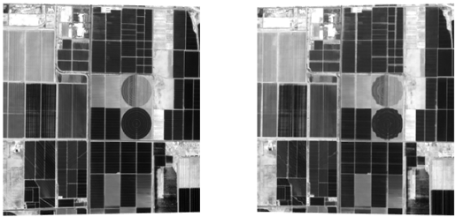
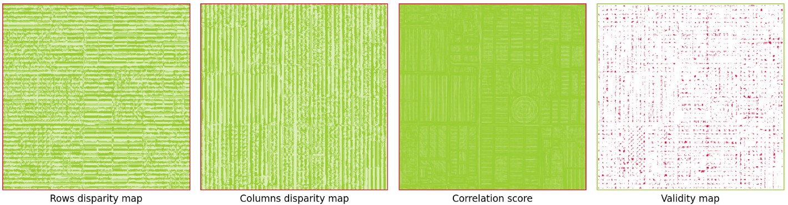

Overviews
=========

Diagram
*******

The following interactive diagram highlights all steps available in Pandora2D.

.. raw:: html

    forced line break,

Configuration file
******************

The configuration file provides a list of parameters to Pandora2D so that the processing pipeline can
run according to the parameters chosen by the user.

Pandora2D works with JSON formatted data with the following nested structures.

.. code:: json

    {
        "input" :
        {
            // input content
        },
        "ROI":
        {
            // ROI content
        },
        "pipeline" :
        {
            // pipeline content
        },
        "output":
        {
            // output content
        }
    }

All configuration parameters are described in :ref:`inputs`, :ref:`roi` and :ref:`step_by_step` chapters.

Example
*******

1. Install

.. code-block:: bash

    pip install pandora2d

2. Create a configuration file

.. code:: json
    :name: Overview example

    {
      "input": {
        "left": {
            "img": "./data/left.tif",
            "nodata": -9999
        },
        "right": {
            "img": "./data/right.tif",
            "nodata": -9999
        },
        "col_disparity": {"init": 0, "range": 2},
        "row_disparity": {"init": 0, "range": 2}
      },
      "pipeline": {
        "matching_cost": {
          "matching_cost_method": "sad",
          "window_size": 5
        },
        "disparity": {
          "disparity_method": "wta",
          "invalid_disparity": -999
        },
        "refinement": {
          "refinement_method": "optical_flow"
        }
      },
      "output": {
          "path": "overview_example_output"
      },
    }

3. Run Pandora2D

.. code-block:: bash

    pandora2d ./config.json
