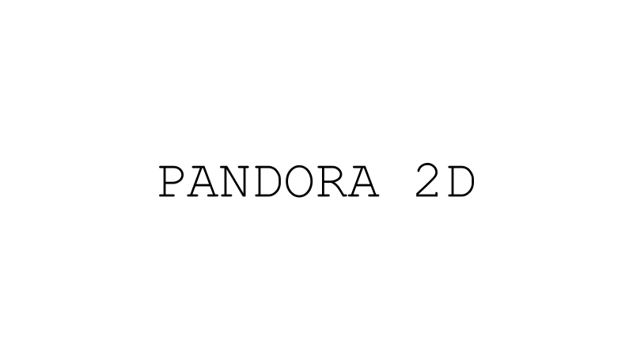

.. _matching_cost:

Matching cost computation
=========================

Theoretical basics
------------------
The first step computes from the pair of images a cost volumes containing the similarity coefficients. The cost volumes is a 4D tensor with dims
[row, col, disp_col, disp_row].

For each disparity in the input vertical disparity range (disp_min_row, disp_max_row),
Pandora2D will shift the right image by the corresponding vertical disparity
and call Pandora to compute a cost volume with the input horizontal disparity range (disp_min_col, disp_max_col).

Different measures of similarity are available in Pandora2D :

- SAD (Sum of Absolute Differences)
- SSD (Sum of Squared Differences)
- ZNCC (Zero mean Normalized Cross Correlation)
- MCCNN (Neural network which computes a similarity measure) (MANDATORY: pandora_plugin_mccnn) (please see: `pandora documentation <https://pandora.readthedocs.io/en/stable/userguide/plugins/plugin_mccnn.html>`_)

Configuration and parameters
----------------------------

.. list-table:: Available parameters
   :widths: 19 19 19 19 19 19
   :header-rows: 1

   * - Name
     - Description
     - Type
     - Default value
     - Available value
     - Required
   * - matching_cost_method
     - Similarity measure
     - str
     -
     - "ssd" , "sad", "zncc", "mc_cnn"
     - Yes.
   * - window_size
     - Window size for similarity measure
     - int
     - 5
     - | > 0 and **odd**
       | or 11 if "matching_cost_method" is "mc_cnn"
       | or >1 if "refinement_method" is "optical_flow"
     - No
   * - step
     - Step [row, col] for computing similarity coefficient
     - list[int, int]
     - [1, 1]
     - list[int >0, int >0]
     - No
   * - subpix
     - Subpix parameter for computing subpixel disparities
     - int
     - 1
     - [1,2,4]
     - No
   * - spline_order
     - Spline order used for interpolation when subpix > 1
     - int
     - 1
     - > 0 and < 6
     - No

.. note::
    The order of steps should be [row, col].

.. warning::
    The subpix parameter can only take values 1, 2 and 4.

**Example**

.. sourcecode:: json
    :name: matching_cost example

    {
        "input" :
        {
            // input content
        },
        "pipeline" :
        {
            //...
            "matching_cost":
            {
                "matching_cost_method": "ssd",
                "window_size": 7,
                "step" : [5, 5],
                "subpix": 4,
            },
            //...
        }
    }