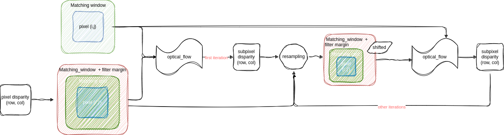

.. _refinement:

Refinement of the disparity maps
================================
The purpose of this step is to refine the disparity identified in the previous step.

Optical_flow method
-------------------
.. warning::
    The optical flow method is still in an experimental phase.
    The parameter window_size in the matching cost parameters requires a value greater than 1 .

Inspired by [Lucas-Kanade]_'s algorithm 

    * We first need to suppose that pixel's shifting are subpixel between left and right images.
    * Second, we need to suppose brightness constancy between left and right images. (2)
    * Now, we can write :

    .. math::

        I(x, y, t) &= I(x + dx, y + dy, t + dt) \\
        I(x, y, t) &=  I(x, y, t) + \frac{\partial I}{\partial x}\partial x + \frac{\partial I}{\partial y}\partial y +\frac{\partial I}{\partial t}\partial t

    with hypothesis (2) :

    .. math::

         \frac{\partial I}{\partial x} dx + \frac{\partial I}{\partial y} dy + \frac{\partial I}{\partial t}dt = 0

    after dividing by :math:`dt`:

    .. math::

         \frac{\partial I}{\partial x} \frac{dx}{dt} + \frac{\partial I}{\partial y} \frac{dy}{dt} = - \frac{\partial I}{\partial t}

    * We can resolve v thanks to least squares method  :

    .. math::

        v = (A^T A)^{-1}A^T B

    * Lucas & Kanade works on a pixel and his neighbourhood so :

    .. math::

        A =
            \left(\begin{array}{cc}
            I_x(q1) & I_y(q1)\\
            I_x(q2) & I_y(q2) \\
            . & . \\
            . & . \\
            . & . \\
            I_x(qn) & I_y(qn)
            \end{array}\right)

        v =
            \left(\begin{array}{cc}
            V_x\\
            V_y
            \end{array}\right)

        B =
            \left(\begin{array}{cc}
            -I_t(q1) \\
            -I_t(q2)  \\
            .  \\
            .  \\
            .  \\
            -I_t(qn)
            \end{array}\right)

The following diagram presents the different steps implemented in Pandora2d to enable
the refinement of the disparity map with optical flow.

.. [Lucas-Kanade]  An iterative image registration technique with an application to stereo vision.
   Proceedings of Imaging Understanding Workshop, pages 121--130.

Dichotomy method
----------------

It’s an iterative process that will, at each iteration:
    * compute the half way positions between each best candidate in the cost volume and its nearest neighbours.
    * compute the similarity coefficients at those positions using the given filter method.
    * find the new best candidate from those computed coefficients.

Available filters are described in :ref:`interpolation_filters`.

.. note::
    Two dichotomy implementations are available in Pandora2d: one in C++ and one in Python. 
    By default, the C++ dichotomy is used when using the “dichotomy” refinement method. 
    To use the Python version, enter “dichotomy_python” as the refinement method in the configuration file. 
 

Configuration and parameters
----------------------------

.. tabs::

    .. tab:: Optical-flow

        Parameters : 

        .. list-table:: 
            :header-rows: 1

            * - Name
              - Description
              - Type
              - Default value
              - Available value
              - Required
            * - *refinement_method*
              - Refinement method
              - string
              - None
              - "optical_flow"
              - Yes
            * - *iterations*
              - Number of iterations
              - int
              - 4
              - >0
              - No

        Configuration example with optical_flow : 

        .. code:: json

            {
                "input" :
                {
                    // input content
                },
                "pipeline" :
                {
                    // ...
                    "refinement":
                    {
                      "refinement_method": "optical_flow",
                      "iterations" : 7
                    },
                    // ...
                },
                "output":
                  {
                     // ...
                  }
            }

    .. tab:: Dichotomy

        .. tabs::
        
            .. tab:: Bicubic

                Parameters : 

                .. list-table:: 
                    :header-rows: 1

                    * - Name
                      - Description
                      - Type
                      - Default value
                      - Available value
                      - Required
                    * - *refinement_method*
                      - Refinement method
                      - string
                      - None
                      - "dichotomy", "dichotomy_python"
                      - Yes
                    * - *iterations*
                      - Number of iterations
                      - int
                      - None
                      - | 1 to 9
                        | *if above, will be bound to 9*
                      - Yes
                    * - *filter*
                      - | Configuration of the filter 
                        | used for interpolation
                      - | dict with key:
                        | - "method"
                      - None
                      - {"method": "bicubic"}
                      - Yes

                Configuration example with dichotomy c++ : 

                .. code:: json

                    {
                        "input" :
                        {
                            // input content
                        },
                        "pipeline" :
                        {
                            // ...
                            "refinement":
                            {
                              "refinement_method": "dichotomy",
                              "filter": {"method": "bicubic"},
                              "iterations" : 7
                            },
                            // ...
                        },
                        "output":
                        {
                           // ...
                        }
                    }
                
                Configuration example with dichotomy python : 

                .. code:: json

                    {
                        "input" :
                        {
                            // input content
                        },
                        "pipeline" :
                        {
                            // ...
                            "refinement":
                            {
                              "refinement_method": "dichotomy_python",
                              "filter": {"method": "bicubic_python"},
                              "iterations" : 7
                            },
                            // ...
                        }
                    }
            
            .. tab:: Cardinal sine

                Parameters : 

                .. list-table:: 
                    :header-rows: 1

                    * - Name
                      - Description
                      - Type
                      - Default value
                      - Available value
                      - Required
                    * - *refinement_method*
                      - Refinement method
                      - string
                      - None
                      - "dichotomy", "dichotomy_python"
                      - Yes
                    * - *iterations*
                      - Number of iterations
                      - int
                      - None
                      - | 1 to 9
                        | *if above, will be bound to 9*
                      - Yes
                    * - *filter*
                      - | Configuration of the filter 
                        | used for interpolation
                      - | dict with keys: 
                        | - "method"
                        | - "size"
                      - None
                      - | {
                        |  "method": "sinc", 
                        |  "size" : 6 to 21, 
                        | }
                      - Yes

                Configuration example with dichotomy c++ : 

                .. code:: json

                    {
                        "input" :
                        {
                            // input content
                        },
                        "pipeline" :
                        {
                            // ...
                            "refinement":
                            {
                              "refinement_method": "dichotomy",
                              "filter": {
                                "method": "sinc",
                                "size": 9
                              },
                              "iterations" : 7
                            },
                            // ...
                        },
                        "output":
                        {
                           // ...
                        }
                    }

                Configuration example with dichotomy python : 

                .. code:: json

                    {
                        "input" :
                        {
                            // input content
                        },
                        "pipeline" :
                        {
                            // ...
                            "refinement":
                            {
                              "refinement_method": "dichotomy_python",
                              "filter": {
                                "method": "sinc_python",
                                "size": 9
                              },
                              "iterations" : 7
                            },
                            // ...
                        }
                    }
            

